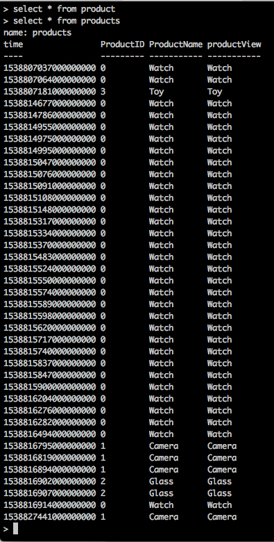
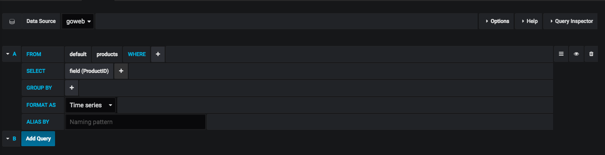
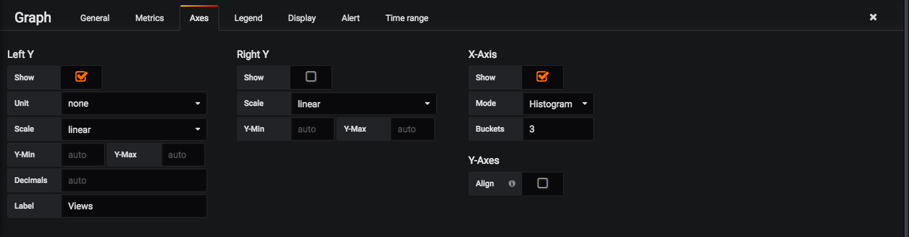
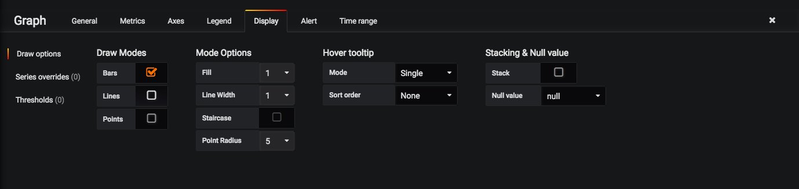
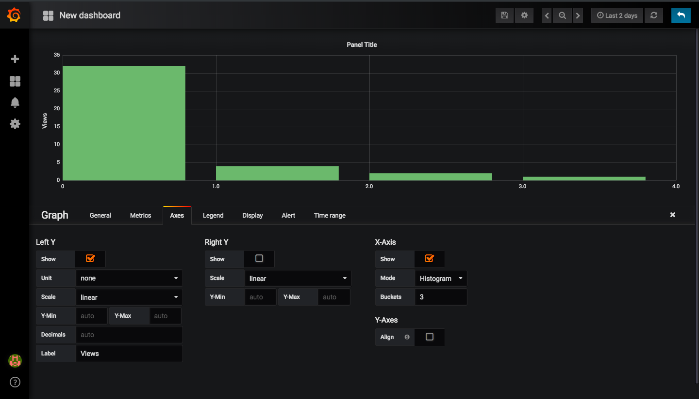
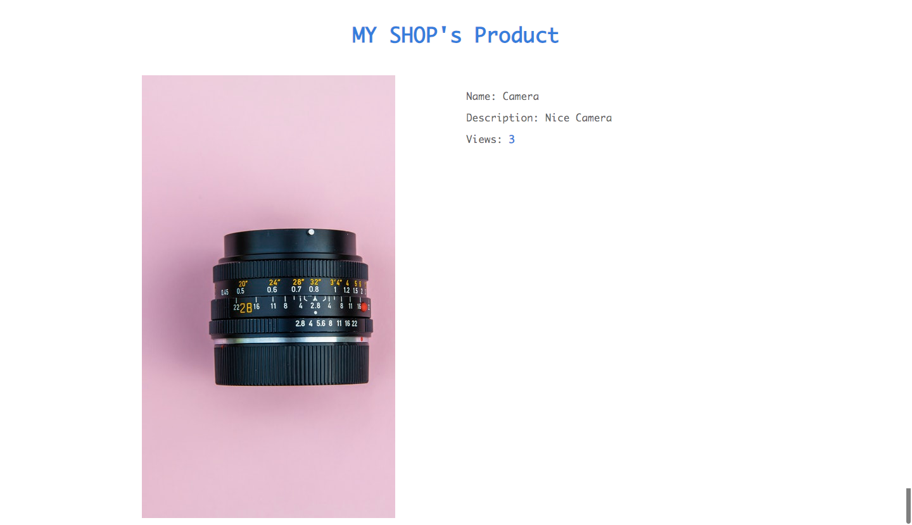

## GO WEB

# Article
For this article, we need to install the following:
- [Golang](https://golang.org/doc/install) (v1.10.2)

- [influxDB](https://portal.influxdata.com/downloads#influxdb) (click on the latest version name (v1.5.2 for at the time of writing this.) and follow the instruction for installing on your operating system. it's pretty straight forward.)

* You can read more on using the influx CLI tool for managing influxDB [here](https://docs.influxdata.com/influxdb/v1.5/introduction/getting-started/). It uses syntax close to SQL, with some minor differences.

We will be building a simple shop to display our cool products and take a measurement of how much visits each product get.


Thankfully, getting a web application up and running in golang is very simple, all we need is a server and some html to serve right?

Our final website folder structure will look like this:
```
.
+-- modules
|   +-- shops
|       +-- db.go
|       +-- handler.go
|       +-- model.go
+-- public
|   +-- assets
|       +-- css
|           +-- tachyons.min.css
|       +-- img
|           +-- camera.jpeg
|           +-- glass.jpeg
|           +-- toy.jpeg
|           +-- watch.jpeg
|   +-- index.html
|   +-- product.html
|   +-- 404.html
+-- main.go
+-- README.md
+-- .gitignore
```

Now let's get our server setup...

`main.go`

```
package main

import (
	"net/http"

	"github.com/spankie/go-web/modules/shops"

	"github.com/go-chi/chi"
	"github.com/go-chi/chi/middleware"
	log "github.com/sirupsen/logrus"
)

func main() {
	r := chi.NewRouter()
	r.Use(middleware.Logger)
	r.Use(middleware.Recoverer)

	fileServer := http.StripPrefix("/assets/", http.FileServer(http.Dir("./public/assets")))
	r.Get("/assets/*", func(w http.ResponseWriter, r *http.Request) {
		w.Header().Set("Vary", "Accept-Encoding")
		w.Header().Set("Cache-Control", "public, max-age=7776000")
		fileServer.ServeHTTP(w, r)
	})

	// Home page route handler
	r.Get("/", shops.GetAllProducts)
	// Product page handler
	r.Get("/product/{ID}", shops.GetProduct)

	r.NotFound(func(w http.ResponseWriter, r *http.Request) {
		http.ServeFile(w, r, "./public/404.html")
	})

	log.Print("👉  Server started at 127.0.0.1:3333")
	http.ListenAndServe(":3333", r)
}
```

We have defined three routes to display the home page (`/`), the product details page (`/product/{id}`), where `ID` is the id of the product we want to view. The last route is any route not explicitly defined which will render a 404 page to the user.

Lets explain what the different handlers do:

`GetAllProducts` 

```
// GetAllProducts fetches all products in my shop
func GetAllProducts(w http.ResponseWriter, r *http.Request) {
	t := template.New("index.html") // Create a template.
	cwd, _ := os.Getwd()
	p := path.Join(cwd, "public", "index.html")
	t, err := t.ParseFiles(p) // Parse template file.
	if err != nil {
		log.Println(err)
	}
	products := Product{}.GetAll() // Get current user infomration.
	err = t.Execute(w, products)   // merge.
	if err != nil {
		log.Println(err)
	}
}
```

This function Parses a `index.html` template and passes the list of all products to be displayed on our homepage.


`GetProduct`:

```
// GetProduct handler for fetching a particular product
func GetProduct(w http.ResponseWriter, r *http.Request) {
	ID, err := strconv.Atoi(chi.URLParam(r, "ID"))
	if err != nil {
		log.Println(err)
		return
	}
	product, err := Product{}.Get(ID)
	if err != nil {
		log.Println(err)
	}
	t := template.New("product.html") // Create a template.
	cwd, _ := os.Getwd()
	p := path.Join(cwd, "public", "product.html")
	t, err = t.ParseFiles(p) // Parse template file.
	if err != nil {
		log.Println(err)
	}
	res, err := queryDB(fmt.Sprintf("select count(ProductID) from products where ProductID = %d", product.ID))
	if err != nil {
		log.Println(err)
	}
	result := res[0]
	if len(result.Series) > 0 {
		product.Views = string(result.Series[0].Values[0][1].(json.Number))
	} else {
		product.Views = "0"
	}
	err = t.Execute(w, product) // merge.
	if err != nil {
		log.Println(err)
	}

	pm := &ProductMeasurement{product.ID, product.Name, time.Now()}

	Insert(structs.Map(pm))
}
```

This function renders a product's details to the `product.html` page, after which, it logs the time the product was viewed in our influxDB

let's analyze the `Insert` function:

```
// Insert saves points to database
func Insert(productMeasurement map[string]interface{}) {
	c, err := client.NewHTTPClient(client.HTTPConfig{
		Addr: "http://localhost:8086",
	})
	if err != nil {
		log.Fatal(err)
	}
	defer c.Close()

	// Create a new point batch
	bp, err := client.NewBatchPoints(client.BatchPointsConfig{
		Database:  MyDB,
		Precision: "s",
	})
	if err != nil {
		log.Fatal(err)
	}

	// Create a point and add to batch
	tags := map[string]string{"productView": productMeasurement["ProductName"].(string)}
	fields := productMeasurement

	pt, err := client.NewPoint("products", tags, fields, time.Now())
	if err != nil {
		log.Fatal(err)
	}
	bp.AddPoint(pt)

	// Write the batch
	if err := c.Write(bp); err != nil {
		log.Fatal(err)
	}

	// Close client resources
	if err := c.Close(); err != nil {
		log.Fatal(err)
	}
}
```

This function creates a client to connect to the database at `localhost` port `8086` which is the default port for the influxDB server

Next a point batch is created to store points to be saved to the DB. A point is then created to store the ProductMeasurement details which includes the time of visit, the id of the product as well as the Name of the product being viewed.

Here is how the DB looks like after insert:



The time field is indexed and stores the exact time the product was viewed. This time can be used to query the DB for analysis.

The queryDB function queries the influxDB and return the result as an array of client.Result type.

```
// queryDB convenience function to query the database
func queryDB(cmd string) (res []client.Result, err error) {
	q := client.Query{
		Command:  cmd,
		Database: MyDB,
	}
	c, err := client.NewHTTPClient(client.HTTPConfig{
		Addr: "http://localhost:8086",
	})
	if response, err := c.Query(q); err == nil {
		if response.Error() != nil {
			return res, response.Error()
		}
		res = response.Results
	} else {
		return res, err
	}
	return res, nil
}

```

This function creates a client as well but this time, creates a query based on the query string passed to it.


These views we have saved on influxDB can be graphically analyzed using [grafana](http://docs.grafana.org/).

After installing grafana from [here](http://docs.grafana.org/), set it up by following their straightfowarad guide on their website. Then do the following:
	
- Create a new dashboard with a graph panel

- Make a query as specified in this screenshot below:
	

- The axes tab should look like this:
	

- Display tab should also look like this:
	

- Your graph should finally look like this:
	

Screeshots:





Dependencies:

- go-chi chi [router](https://github.com/go-chi/chi) This is a lightweight, idiomatic and composable router for building Go HTTP services

- [InfluxDB Go Client](github.com/influxdata/influxdb/client/v2)

- UI Library [tachyons.io](http://tachyons.io) is a library for creating fast loading, highly readable, and 100% responsive interfaces with as little css as possible.